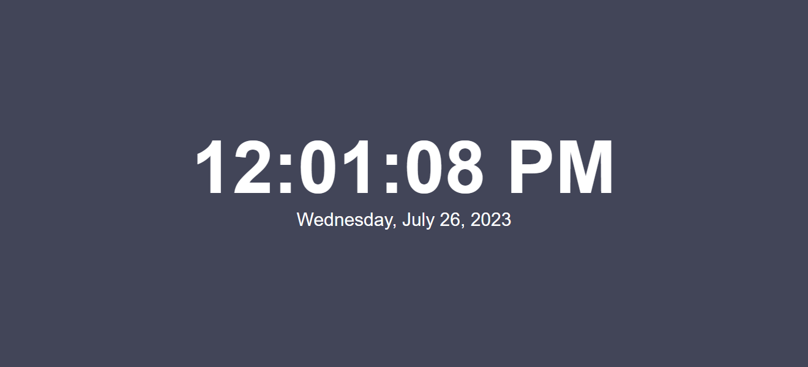
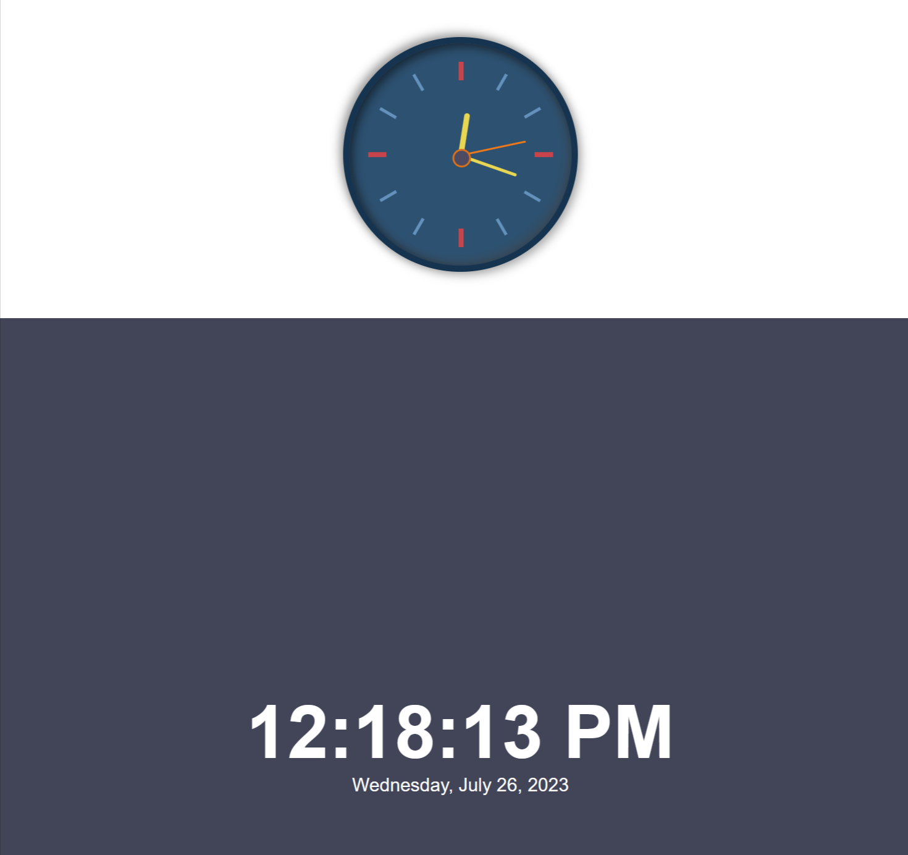
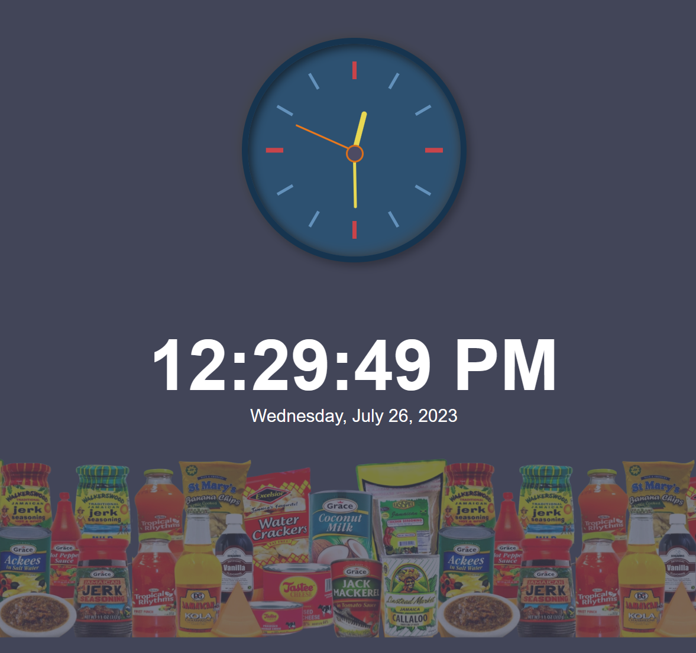
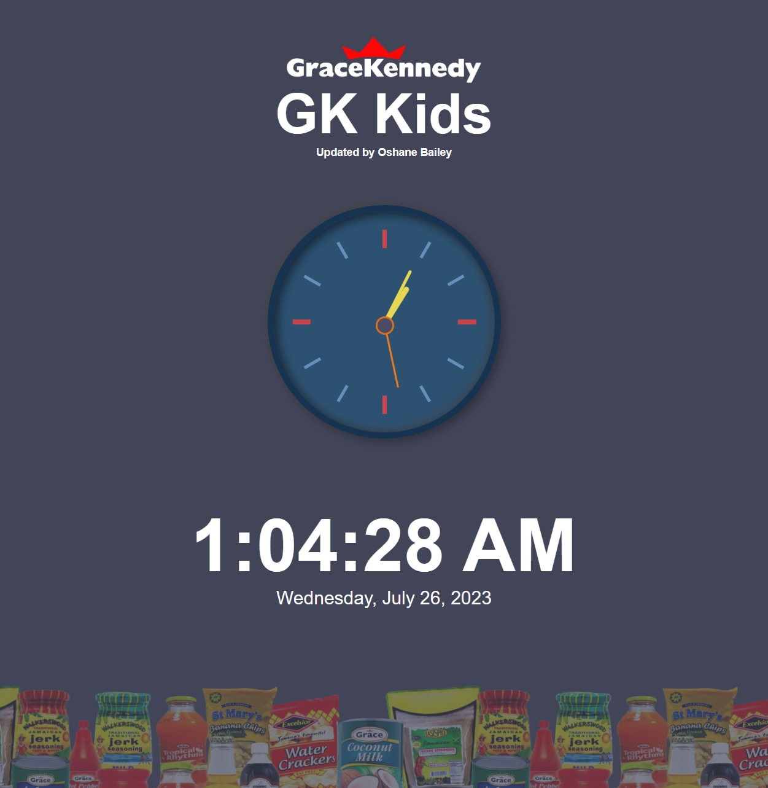
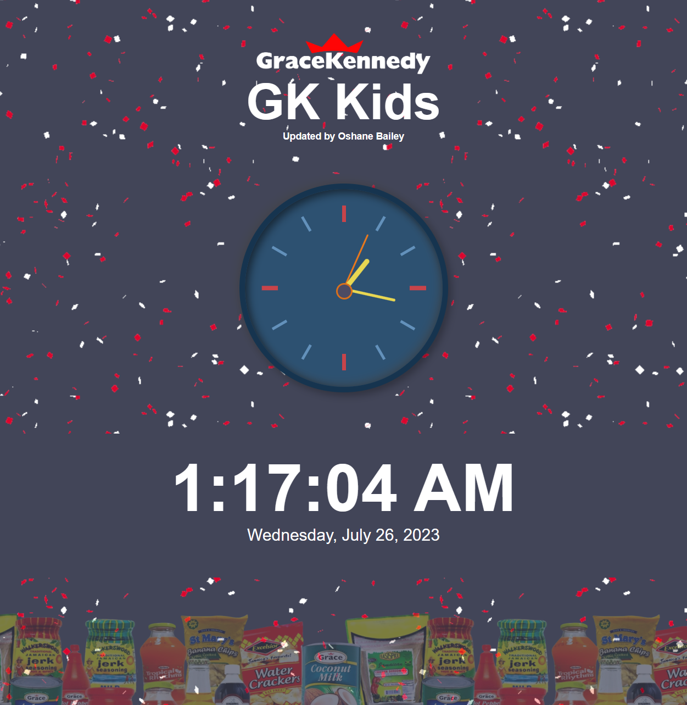

# HTML5 Digital and Analog Clocks with JavaScript | Beginner Project

Great! Let's start by creating the basic structure of the digital clock using HTML. We'll use a simple layout with a container for the clock display.

Here's the HTML code for the initial structure:

```html
<!DOCTYPE html>
<html lang="en">

<head>
    <meta charset="UTF-8">
    <meta name="viewport" content="width=device-width, initial-scale=1.0">
    <title>GK Kids Clock</title>
</head>

<body>

</body>

</html>
```

## Step 1: Implementing the Digital Clock
The digital clock is much easier to implement than the anolog clock, even though the latter is much cooler.

### Step 1.1: Add HTML structure for the digital clock
The first step we need to take is to add the digital clock html structure between the `body` tags:

```html
    <!-- Start: digital clock structure -->
    <div class="digial-clock">
        <!-- Element for the current timestamp -->
        <div class="time"></div>
        <!-- Element for the current date  -->
        <div class="date-time"></div>
    </div>
    <!-- End: digital clock structure -->
```

### Step 1.2: Add the digital clock external styles
Add the css file for the digital clock to the `head` element using the code below:
```html
    <link rel="stylesheet" href="./digital/styles.css" type="text/css" />
```

### Step 1.3: Add the digital clock external styles
Add the following ***JavaScript*** library for the digital clock just before the closing `body` tag:

```html
    <!-- JavaScript library for Digital Clock -->
    <script src="./digital/digitalclock.js"></script>
```

This JavaScript library consists of two functions: `updateDigitalClock()` and `startDigitalClock()`. The `updateDigitalClock()` function gets the current time and updates the corresponding elements in the HTML. The `startDigitialClock()` function calls `updateDigitalClock()` initially and then sets an interval to call `updateDigitalClock()` every second (1000ms).

### Step 1.4: Trigger digital clock to start on page load
Start displaying the current time of the digital clock by using the `startDigitalClock()` function in the `window.load` function.

```html
    <!-- JavaScript for Digital Clock -->
    <script>
        // Start the clock when the page is loaded
        window.onload = function() {
            startDigitalClock();
        };
    </script>
```

Save and open the html file in your browser. It should look like the screenshot below:




## Step 2: Implementing the Analog Clock
Now that we've completed the Digital Clock, let's add the analog clock right above the digital clock.

### Step 2.1: Add HTML structure for the digital clock
Add the html code for the analog just above the opening tag (`<div class="digial-clock">`) for the digital clock section:

```html
    <!-- Start: analog clock structure -->
    <div class="analog-clock">
        <!-- Start: analog clock outer face with border -->
        <div class="outer-clock-face">
            <!-- Marker: on the hour -->
            <div class="marking marking-one"></div>
            <!-- Marker: 15 minutes after the hour -->
            <div class="marking marking-two"></div>
            <!-- Marker: 30 minutes after the hour -->
            <div class="marking marking-three"></div>
            <!-- Marker: 45 minutes after the hour -->
            <div class="marking marking-four"></div>
            <!-- Start: analog clock inner face with the different hands  -->
            <div class="inner-clock-face">
                <!-- Time Pointer: hour hand -->
                <div class="hand hour-hand"></div>
                <!-- Time Pointer: minutes hand -->
                <div class="hand min-hand"></div>
                <!-- Time Pointer: seconds hand -->
                <div class="hand second-hand"></div>
            </div>
            <!-- End: analog clock inner face with the different hands  -->
        </div>
        <!-- End: analog clock outer clock face with border -->
    </div>
    <!-- End: analog clock structure -->
```

### Step 2.2: Add the analog clock external styles
Add the css file for the analog clock just after the extenal css file for the digital clock.
```html
    <link rel="stylesheet" href="./analog/styles.css" type="text/css" />
```

### Step 2.3: Add the analog clock external styles
Add the following ***JavaScript*** library for the analog clock just after the ***JavaScript*** library for the digital clock:

```html
    <!-- JavaScript library for Analog Clock -->
    <script src="./analog/analogclock.js"></script>
```

This JavaScript library consists of two functions: `updateAnalogClock()` and `startAnalogClock()`. The `updateAnalogClock()` function gets the current time and updates the corresponding elements in the HTML. The `startDigitialClock()` function calls `updateAnalogClock()` initially and then sets an interval to call `updateAnalogClock()` every second (1000ms).


### Step 2.4: Trigger analog clock to start on page load
Start displaying the current time of the analog clock by adding the `startAnalogClock()` function in the `window.load` function.

The load function should look like the following code:
```html
    <!-- JavaScript for Digital Clock -->
    <script>
        // Start the clock when the page is loaded
        window.onload = function() {
            startDigitalClock();
            startAnalogClock();
        };
    </script>
```

Save and open the html file in your browser. It should look like the screenshot below:



## Step 3: Customizing the page
Now that we've successfully implemented both the analog and digital clocks on the same page, it's time to customize the appearance of the page. We'll achieve this by adding new elements, new styles and overriding the old ones to give the clocks a unique and visually appealing look. Let's dive into the CSS and make our clocks stand out!

### Step 3.1: Update page styles
Add the following lines to `head` tag, just below the extenal styles for analog clock.
```html
    <style>
        /* Update the body background color */
        body  {
            background-color: #424558;
        }

        /* Add padding and minimum height to the page */
        body {
            min-height: 90vh;
            position: relative;
            padding-bottom: 50px;
        }

        /* Add a celebration gif */
        body.celebrate {
            background-image: url(./img/celebrate.gif);
        }

        /* Add dynamic footer */
        body::before {
            content: "";
            position: absolute;
            height: 500px;
            width: 100%;
            bottom: 0;
            left: 0;
            z-index: 100000;
             background-image: url(./img/foods.png);
            background-position: bottom;
            background-repeat: repeat-x;
            background-size: 500px;
            opacity: 0.3
        }

        /* Override digital clock styles */
        .digial-clock {
            height: auto;
            padding-top: 20px;
            padding-bottom: 40px;
            background-color: none;
        }
    </style>
```

Once you've added the new in page styles, the page should look like the following screenshot:



### Step 3.2: Add GK branding on the page
Insert the provided code between the opening <body> tag and the section where the analog clock is located to add branding details at the top of the page.

```html
    <!-- Start: branding -->
    <h1 class="brand-section">
        <!-- Branding logo -->
        
        <!-- Branding name -->
        <span class="brand-title">GK Kids</span>
    </h1>
    <!-- Updated by developer -->
    <h3 class="updated-by" >Updated by Oshane Bailey</h3>
    <!-- End: branding -->
```

Once you've made the changes, the page should look like the following screenshot:



#### Task
- Update the brand title text to an appropriate text.
- Change name of the develop from `Oshane Bailey` to your name.


### Step 3.3: Add a hooray background
Add a celebratory background whenever the number of seconds is less than 15.

Due to the conditional nature of this feature to check if the number of seconds within a minute is less than 15 seconds, we would need to write some ***JavaScript*** code.

```javascript
    // Run function in interval of x miliseconds.
    setInterval(
        function() {
            // Get the current date and time.
            var now = new Date();
            // Get the current seconds
            var seconds = now.getSeconds();
            // Check if the current seconds is less than or equal to 15.
            if ( seconds <= 15 ) {
                // Check if the body element has the celebrate class
                if ( ! document.body.classList.contains('celebrate') ) {
                    // if not, add the celebrate class to the body
                    document.body.classList.add('celebrate');
                }
            } else {
                // Check if the body element has the celebrate class
                if ( document.body.classList.contains('celebrate') ) {
                    // if yes, then remove it the celebrate class
                    document.body.classList.remove('celebrate');
                }
            }
        }, 
        1000 // number of miliseconds, i.e. seconds * 1000
    )
```
Once you've made the changes, the page should look like the following screenshot:



#### Task
- Change the celebration gif (image)